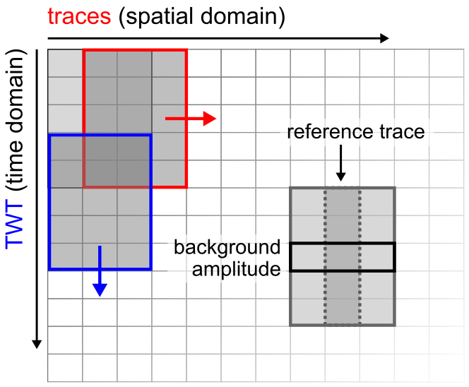

# 2D despiking

Despike SEG-Y file(s) using a 2D moving window function.

## Description

Remove (**single trace**) noise bursts from seismic data using an user-defined moving 2D window (_time_ x _ntraces_) approach: 

1. Define moving **2D window** (_time_ x _ntraces_) with `overlap` in time domain (in percent)
2. Compute **background amplitude** per time sample over _ntraces_ using user-specified function
      - `mean`: average amplitude
      - `rms`: _root mean squared_ amplitude
      - `median`: median amplitude
3. Compare reference trace amplitudes with computed background amplitudes using user-specified `threshold` and 
      - `amplitude > threshold * background amplitude` → **spike** detection
      - `amplitude <= threshold * background amplitude` → **no** spike
4. Replace detected spike samples using user-specified method:
      - `scaled`: Scale signal down to background amplitude (based on mode). Tapering applied.
      - `mode`: Replace with background amplitude values
      - `threshold`: Replace with `threshold * background` amplitude values.
      - `zeros`: Replace with zero values.
      - `median`: Replace with median values (calculated from neighboring traces).

<figure markdown>
{ width="400" }
<figcaption>Figure 1: Schematics of 2D despike algorithm.</figcaption>
</figure markdown>

## Usage

This script is designed to be used from the terminal (i.e. command line).

### Command line interface

The script can handle three different inputs:

1. single SEG-Y file (e.g., `filename.sgy`)
2. datalist of files to process (e.g., `datalist.txt`)
3. directory with input files (e.g., `/input_dir`) 

There are two options to run the script. We recommend using the CLI entry point like:

```bash
>>> 08_despike {filename.sgy | datalist.txt | </directory>} [optional parameters]
```

Alternatively, the script can be executed using the (more verbose) command:

```bash
>>> python -m pseudo_3D_interpolation.despiking_2D_segy {filename.sgy | datalist.txt | </directory>} [optional parameters]
```

Optionally, the following parameters can be specified:

- `--help`, `-h`: Show help.
- `--output_dir {DIR}`: Output directory (either `--inplace` or `--output_dir` are **required**!).
- `--inplace`: Replace input data without creating copy (either `--inplace` or `--output_dir` are **required**!).
- `--suffix {sgy}`: File suffix (default: `sgy`). Only used if directory is specified.
- `--filename_suffix {SUFFIX}`: Filename suffix (e.g. `pad`, `static`) to filter input files. Only used if directory is specified.
- `--txt_suffix {despk}`: Suffix to append to output filename (default: `despk`).
- `--use_delay`: Use delay recording time to split input data before despiking (e.g. for TOPAS, Parasound).
- `--byte_delay {109}`: Byte position of input delay times in SEG-Y file(s) (default: `109`).
- `--mode {MODE}`: Mode used to compute background amplitude and detect spikes in data.
     - `mean`, `rms`, or `median`
- `--window_time {TIME}`: Moving window length in time domain (TWT [ms]).
- `--window_traces {TRACES}`: Moving window length in offset domain (traces [#]).
- `--window_overlap {PERCENT}`: Time overlap of moving windows (%) (default: `10`).
- `--threshold_factor {FACTOR}`: Used for spike detection (threshold_factor * background amplitude).
- `--out_amplitude {METHOD}`: Replace spike amplitudes using selected method
     - `scaled`, `mode`, `threshold`, `zeros`, `median`
- `--verbose {LEVEL}`: Level of output verbosity (default: `0`).

### Python script

**Import function**

```python
import despike_2D
```

**Create dummy data**

```python
import numpy as np

dt = 0.05  # ms
length = 250  # ms
ntraces = 100
shape = (int(length / dt), ntraces)

# create dummy data
data = np.ones(shape, dtype='float32')
# insert noise burst
noise_time = slice(int(100/dt), int(120/dt))
noise_trace = 50
data[noise_time, noise_trace] = 5
# add some noise
data += np.random.standard_normal(shape)
```

**Despike dummy data**

```python
window = 30  # length (ms) of window, should be larger than noise (~20 ms)
data_despk = despike_2D(
    data, window, dt, overlap=10, ntraces=5, mode='mean', threshold=2, out='scaled', verbosity=0
    )
```

**Compare original vs despiked data**

```python
print('original data:', data[noise_time, noise_trace], sep='\n')
    print('despiked data:', data_despk[noise_time, noise_trace], sep='\n')
```