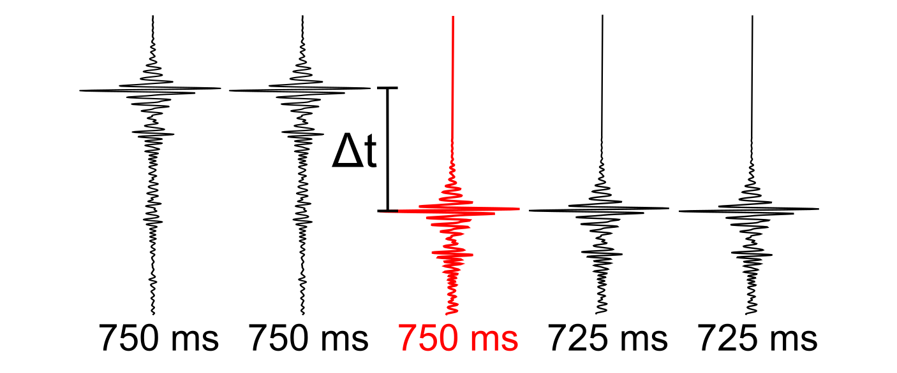

# Correct DelayRecordingTime (delrt)

Utility script to fix incorrect _DelayRecordingTime_ (_delrt_) in SEG-Y file(s).

## Description

Utility script to fix incorrect _DelayRecordingTimes_ (_delrt_) header value in SEG-Y file(s) by comparing maximum amplitudes of neighboring traces in user-defined moving windows (default: _120 samples x 5 traces_).

1. **Extract** (multiple) _DelayRecordingTimes_ from SEG-Y trace header
2. **Find maximum amplitude** of reference (center) trace and select data subset based on `win_ntraces` and `win_nsamples`
3. Create boolean mask of detected _delrt_ values using difference amplitudes relative to reference amplitude
      - e.g. [625, 625, **625**, 700, 700] (in ms) → [1, 1, **1**, 0, 0]
4. Create boolean mask of _delrt_ values from trace header
      - e.g. [625, 625, **700**, 700, 700] (in ms) → [1, 1, **0**, 0, 0]
5. Compare both masks and update incorrect trace headers
      - [625, 625, **700**, 700, 700] (in ms) → [625, 625, **625**, 700, 700] (in ms) 



<figcaption>Figure: Incorrect assigned delrt (red trace) in trace header.</figcaption>

## Usage

This script is designed to be used from the terminal (i.e. command line).

### Command line interface

The script can handle three different inputs:

1. single SEG-Y file (e.g., `filename.sgy`)
2. datalist of files to process (e.g., `datalist.txt`)
3. directory with input files (e.g., `/input_dir`) 

There are two options to run the script. We recommend using the CLI entry point like:

```bash
>>> 03_correct_delrt {filename.sgy | datalist.txt | </directory>} [optional parameters]
```

Alternatively, the script can be executed using the (more verbose) command:

```bash
>>> python -m pseudo_3D_interpolation.delrt_correction_segy {filename.sgy | datalist.txt | </directory>} [optional parameters]
```

Optionally, the following parameters can be specified:

- `--help`, `-h`: Show help.
- `--output_dir {DIR}`: Output directory (either `--inplace` or `--output_dir` are required!).
- `--inplace`: Replace input data without creating copy (either `--inplace` or `--output_dir` are required!).
- `--suffix {sgy}`: File suffix (default: `sgy`). Only used if directory is specified.
- `--filename_suffix {SUFFIX}`: Filename suffix (e.g. `pad`, `static`) to filter input files. Only used if directory is specified.
- `--txt_suffix {despk}`: Suffix to append to output filename (default: `despk`).
- `--byte_delay {109}`: Byte position of input delay times in SEG-Y file(s) (default: `109`).
- `--win_nsamples {SAMPLES}`: Moving window length in time domain (samples [#]).
- `--win_ntraces {TRACES}`: Moving window length in offset domain (traces [#]).
- `--verbose {LEVEL}`: Level of output verbosity (default: `0`).
