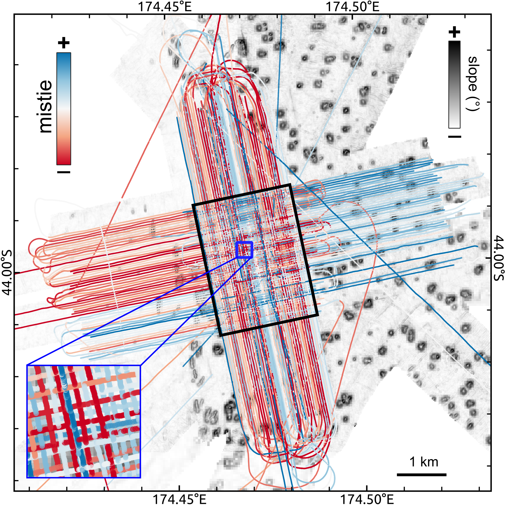
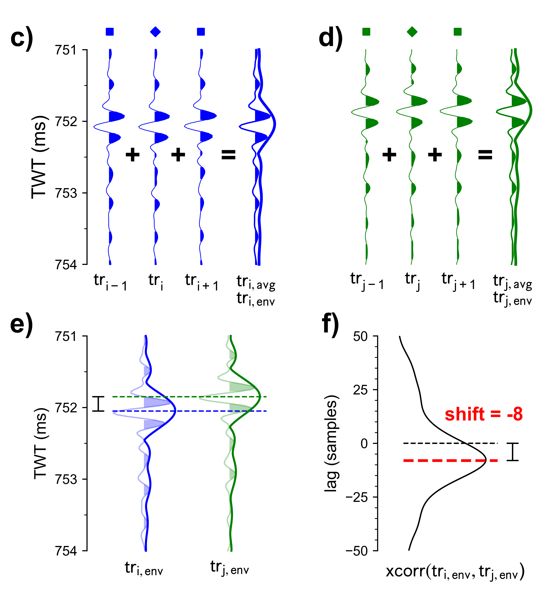

# Mistie correction

Compensate mistie for SEG-Y file(s) via cross-correlation of nearest traces of intersecting lines.

## Description

This script corrects the vertical mistie at profile intersections by calculating an individual (i.e. global) bulk shift value for each input profile using least-squars minimization. 
In case of several overlapping profiles with many intersections, this _closed-loop_ configuration (Harper, 1991) can be represented as a set of over-determined equations and solved following the approach proposed by Bishop and Nunns (1994).

<figure markdown>
{ width="500" }
    <figcaption>Figure 1: Mistie (in time domain) for individual TOPAS profiles (left).</figcaption>
</figure>

The general workflow is summarized in the following steps:

1. Calclulate **profile intersections** 
2. Extract **nearest trace(s)** at intersections based on euclidean distance (optionally in user-defined vertical window)
3. Create **reference trace** from nearest traces (reduce effect of noisy traces)
      - calculating trace envelope for more performant cross-correlation
4. Compute **cross-correlation** of reference traces
5. Remove low-quality cross-correlation using an user-defined **quality threshold** (Pearson's correlation coefficient in [SciPy](https://docs.scipy.org/doc/scipy/reference/generated/scipy.stats.pearsonr.html))
6. Calculate single bulk shift value for each profile using **least-squares minimization**
7. Apply bulk shift (for individual lines)

<figure markdown>
 for individual TOPAS profiles"){ width="400" align=left }
{ width="350" align=right }
</figure>
<figcaption>Figure 2: Conceptual mistie correction at intersection of two examplary profiles.</figcaption>

## Usage

This script is designed to be used from the terminal (i.e. command line).

### Command line interface

The script can handle two different inputs:

1. datalist of files to process (e.g., `datalist.txt`)
2. directory with input files (e.g., `/input_dir`) 

There are two options to run the script. We recommend using the CLI entry point like:

```bash
>>> 07_correct_mistie {filename.sgy | datalist.txt | </directory>} [optional parameters]
```

Alternatively, the script can be executed using the (more verbose) command:

```bash
>>> python -m pseudo_3D_interpolation.mistie_correction_segy {filename.sgy | datalist.txt | </directory>} [optional parameters]
```

Optionally, the following parameters can be specified:

- `--help`, `-h`: Show help.
- `--output_dir {DIR}`: Output directory (either `--inplace` or `--output_dir` are **required**!).
- `--inplace`: Replace input data without creating copy (either `--inplace` or `--output_dir` are **required**!).
- `--suffix {sgy}`: File suffix (default: `sgy`). Only used if directory is specified.
- `--filename_suffix {SUFFIX}`: Filename suffix (e.g. `pad`, `static`) to filter input files. Only used if directory is specified.
- `--txt_suffix {despk}`: Suffix to append to output filename (default: `despk`).
- `--coords_origin`: Origin of (shotpoint) coordinates (i.e. navigation).
     - `header` (**default**): Extract coordinates from SEG-Y header(s).
     - `aux`: Read previously extracted coordinates from auxiliary file.
- `--coords_path`: Path to SEG-Y directory (coords_origin=`header`) or navigation file with coordinates (coords_origin=`aux`)
- `--win_cc`: Upper/lower trace window limits used for cross-correlation (in ms), e.g., for using only seafloor reflection.
- `--quality_threshold`: Cut-off threshold for cross-correlation [0-1] used to remove noisy/insufficient intersections.
- `--write_aux`: Write mistie offsets to auxiliary file (`*.mst`).
- `--write_QC`: Write line intersections and nearest traces to GeoPackage (`*.gpkg`).
- `--verbose {LEVEL}`, `-V`: Level of output verbosity (default: `0`).

## References

- Harper, Michael D. 1991. “Seismic Mis‐tie Resolution Technique.” _Geophysics_ 56 (11): 1825–30. https://doi.org/10.1190/1.1442995. 
- Bishop, Thomas N., and Alan G. Nunns. 1994. “Correcting Amplitude, Time, and Phase Mis‐ties in Seismic Data.” _Geophysics_ 59 (6): 946–53. https://doi.org/10.1190/1.1443654.