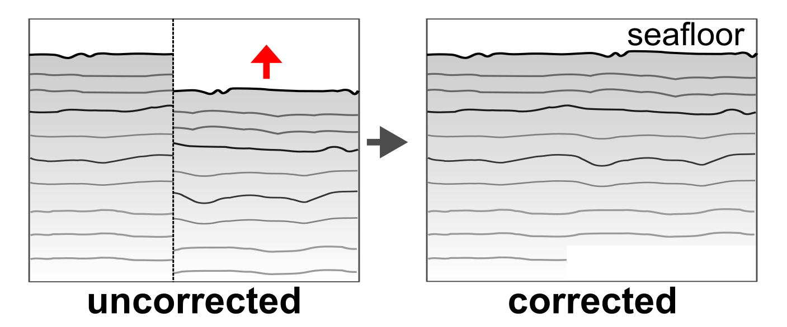

# Trace padding

Pad traces in SEG-Y file(s) to correct _DelayRecordingTime_.

## Description

Check for vertical offsets in SEG-Y file(s) using trace header keyword _DelayRecordingTime_ (_delrt_) and pad seismic trace with zeros to compensate variable recording starting times.

1. **Detect** changing _DelayRecordingTime_ based on trace header values
2. **Split** input profile into multiple segments of different _derlt_
3. **Pad** start (_top_) and end (_bottom_) of traces per segment to _minimum_ and _maximum delrt_ (using zeros)
4. **Write** padded data to new SEG-Y file(s)

<figure markdown>
{ width=500 }
<figcaption>Figure: Schemetic showing trace padding effect.</figcaption>
</figure>

## Usage

This script is designed to be used from the terminal (i.e. command line).

### Command line interface

The script can handle three different inputs:

1. single SEG-Y file (e.g., `filename.sgy`)
2. datalist of files to process (e.g., `datalist.txt`)
3. directory with input files (e.g., `/input_dir`) 

There are two options to run the script. We recommend using the CLI entry point like:

```bash
>>> 04_pad_delrt {filename.sgy | datalist.txt | </directory>} [optional parameters]
```

Alternatively, the script can be executed using the (more verbose) command:

```bash
>>> python -m pseudo_3D_interpolation.delrt_padding_segy {filename.sgy | datalist.txt | </directory>} [optional parameters]
```

Optionally, the following parameters can be specified:

- `--help`, `-h`: Show help.
- `--output_dir {DIR}`: Output directory (either `--inplace` or `--output_dir` are required!).
- `--suffix {sgy}`: File suffix (default: `sgy`). Only used if directory is specified.
- `--filename_suffix {SUFFIX}`: Filename suffix (e.g. `pad`, `static`) to filter input files. Only used if directory is specified.
- `--txt_suffix {despk}`: Suffix to append to output filename (default: `despk`).
- `--byte_delay {109}`: Byte position of input delay times in SEG-Y file(s) (default: `109`).
- `--verbose {LEVEL}`: Level of output verbosity (default: `0`).

**NOTE:** Since the total number of traces per file changes, the files **cannot** be updated inplace!