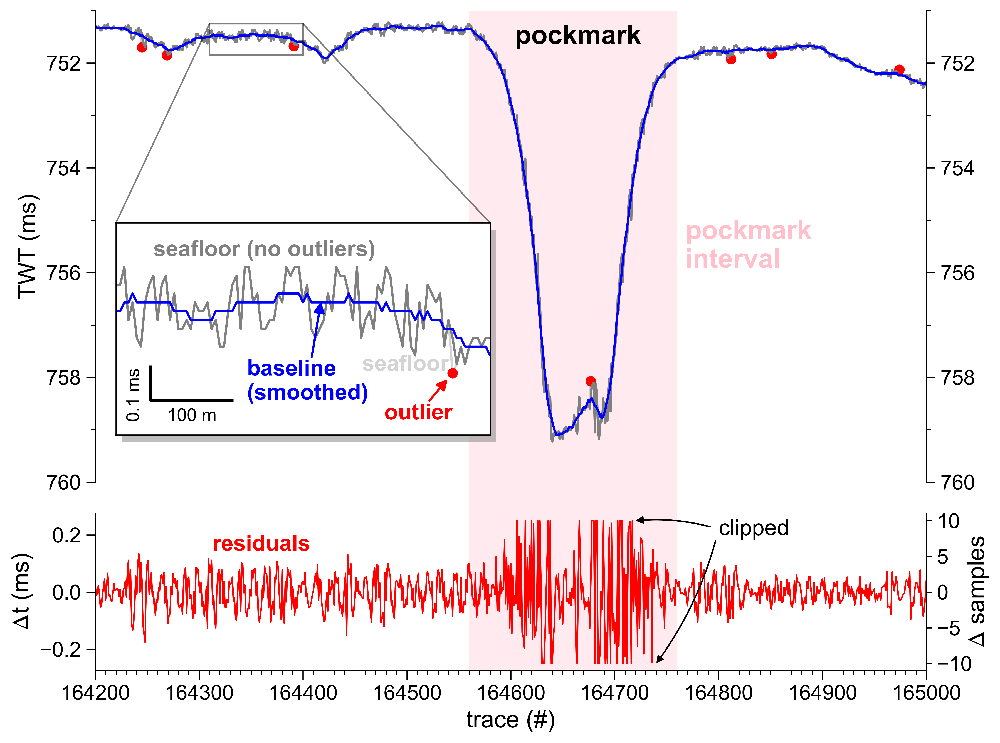

# Static correction

Compensate static effect of 2D profiles.

## Description

Compensate residual static (e.g. swell) on seismo-acoustic profile(s) using either _SourceWaterDepth_ (mode: `swdep`) or first positive amplitude peak of seafloor reflection (mode: `amp`).

1. Retrieve seafloor reflection TWT values from
      - `swdep`: _SourceWaterDepth_ stored in trace header (originating from simultaneously operating multibeam echosounder)
      - `amp`: detected seafloor amplitude
2. Filter outlier from seafloor TWT values using a rolling double [medium absolute deviation (MAD)](#median-absolute-deviation-mad) filter

<figure markdown>
{ width=600 }
<figcaption>Figure: Examplary TOPAS profile subsection</figcaption>
</figure>

### Seafloor reflection detection (first-break picking)

The basis for an sufficient static correction is a precise detection of the seafloor reflection amplitudes. Here, the STA/LTA ratio method commonly used in seismology is adapted. It uses the ratio of averages between a short-term  and a long-term window, which is denoted as STA/LTA (short-term average/long-term average).  
This method uses **1%** and **5%** of the total trace length for the determination of the short-term and long-term window length, respectively. Based on a first (rought) first break pick, a narrow time window ($\pm$ 50 samples around picked time) is defined and the shallowest (i.e. smallest two-way travel time) of the _five_ largest amplitudes flagged as the seafloor amplitude.  
These picks are filtered and used to calculate the residual statics in subsequent steps.

### Median Absolute Deviation (MAD)

The **medium absolute deviation** (MAD) is a measure of variability and can be used as a robust alternative for an outlier detection algorithm based on the more common standard deviation $\sigma$ (see [Wikipedia](https://en.wikipedia.org/wiki/Median_absolute_deviation)). The MAD is defined as the median of the absolute deviations from the data median:

$$
MAD = c * median(|x_{i} - \bar{x}|)
$$

where $x_{i}$ are the data values, $\bar{x}$ the data median value and $c$ is a constant, with $c = 1.4826$ for normally distributed values.
The _lower_ and _upper_ threshold values $T$ for the outlier detection are computed as follows:

$$
\displaylines{
    T_{lower} = \bar{x} - k * MAD \\
    T_{upper} = \bar{x} + k * MAD
}
$$  

where $k = 3$ corresponds to the $3\sigma$ rule commonly used in threshold-based outlier detection.

The assumption of a normal distribution, however, is often not suitable for real world datasets. In order to account for skewed distributions when detecting outliers, a **double MAD** algorithm has been proposed ([Rosenmai, 2013](https://eurekastatistics.com/using-the-median-absolute-deviation-to-find-outliers/)). This simple approach includes the separate computation of a _lower_ and _upper_ MAD for values below and above the median:

$$

\displaylines{
    MAD^{lower} = c * median(|x_i^{lower} - \bar{x}|) \\
    MAD^{upper} = c * median(|x_i^{upper} - \bar{x}|)
}
$$

Consequently, the thresholds for the outlier detection change based on the corresponding MAD:

$$
\displaylines{
    T_{lower} = \bar{x} - k * MAD^{lower} \\
    T_{upper} = \bar{x} + k * MAD^{upper} 
}
$$

Here, the MAD is used to identify and remove outliers from the picked seafloor horizon (_red dots_, **Figure**).

### Smoothing filter

The seafloor horizon is low-passed filtered using a Savitzky-Golay filter (Savitzky and Golay, 1964) to derive a smooth version closely representing the seafloor unaffected by static (_solid blue line_, **Figure**). 
One advantage of this filter is its capability to efficiently smooth data without distorting the underlying signal.
The efffect of residual static is calculated as the difference between observed, non-smoothed and filtered, smoothed seafloor horizon (_red line_, **Figure**).

## Usage

This script is designed to be used from the terminal (i.e. command line).

### Command line interface

The script can handle three different inputs:

1. single SEG-Y file (e.g., `filename.sgy`)
2. datalist of files to process (e.g., `datalist.txt`)
3. directory with input files (e.g., `/input_dir`) 

There are two options to run the script. We recommend using the CLI entry point like:

```bash
>>> 05_correct_static {filename.sgy | datalist.txt | </directory>} [optional parameters]
```

Alternatively, the script can be executed using the (more verbose) command:

```bash
>>> python -m pseudo_3D_interpolation.static_correction_segy {filename.sgy | datalist.txt | </directory>} [optional parameters]
```

Optionally, the following parameters can be specified:

- `--help`, `-h`: Show help.
- `--output_dir {DIR}`: Output directory (either `--inplace` or `--output_dir` are required!).
- `--inplace`: Replace input data without creating copy (either `--inplace` or `--output_dir` are required!).
- `--suffix {sgy}`: File suffix (default: `sgy`). Only used if directory is specified.
- `--filename_suffix {SUFFIX}`: Filename suffix (e.g. `pad`, `static`) to filter input files. Only used if directory is specified.
- `--txt_suffix {despk}`: Suffix to append to output filename (default: `despk`).
- `--use_delay`: Use delay recording time to split input data before despiking (e.g. for TOPAS, Parasound).
- `--byte_delay {109}`: Byte position of input delay times in SEG-Y file(s) (default: `109`).
- `--mode {amp}`: Mode used to correct residual static (default: `amp`).
     - `amp`: detected seafloor amplitude 
     - `swdep`: stored _SourceWaterDepth_ from trace header (if available).
- `--win_mad {TRACES}`: Moving window length for MAD filter (traces [#]).
- `--win_sg {7}`: Moving window length for Savitzky-Golay smoothing filter (traces [#]).
- `--limit_shift`: Limit maximum vertical shift of individual traes (in samples)
- `--limit_depressions`: Limit maximum vertical shift in area of seafloor depressions using a transition zone [pad, max_edges, max_center] (as integer)
     - _default:_ `[10, 10, 5]`
- `--write_seafloor2trace`: If mode is `amp` write TWT of peak seafloor amplitude to SEG-Y trace header
- `--write_aux`: Write trace information and computed static to auxiliary file (`*.sta`)
- `--verbose {LEVEL}`, `-V`: Level of output verbosity (default: `0`).

## References

- Rosenmai, Peter (2013) Using the Median Absolute Deviation to Find Outliers, https://eurekastatistics.com/using-the-median-absolute-deviation-to-find-outliers/, last accessed: 27 June 2022
- Savitzky, A., & Golay, M. J. (1964). Smoothing and differentiation of data by simplified least squares procedures. _Analytical chemistry_, _36_(8), 1627-1639.