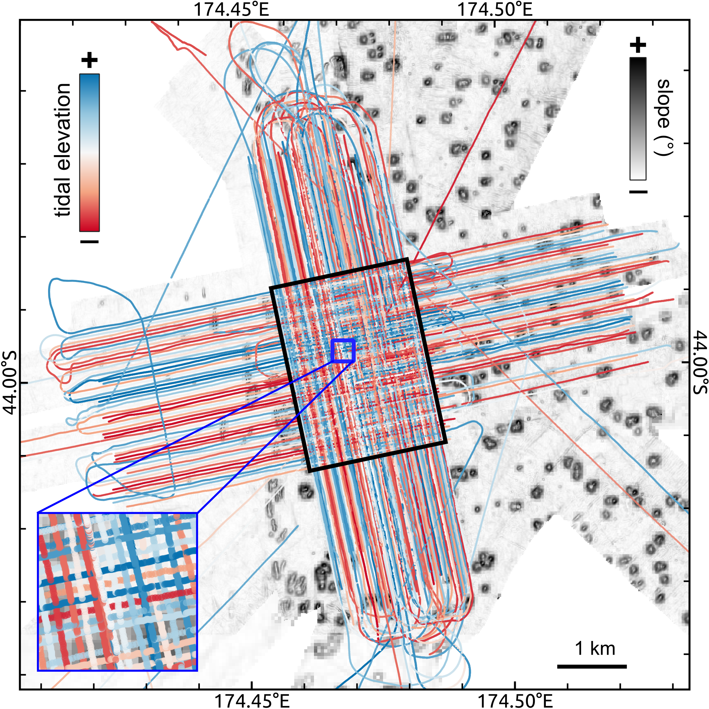

# Tide compensation

Compensate varying tidal elevations that might occur during seismo-acoustic surveys. 

## Description

The tidal elevation (and thus deviation from the _mean sea level_) is predicted using the tidal constituents based on the [TPXO9-atlas](https://www.tpxo.net/global/tpxo9-atlas) models provided by [Gary Egbert & Svetlana Erofeeva from the Oregon State University](https://www.tpxo.net/home) (available on request for academic purposes).

To derive an individual tidal elevation for each shotpoint (and time) the Python package [`tpxo-tide-prediction`](https://github.com/fwrnke/tpxo-tide-prediction) is utilized that allows to compute the required tidal information for each shotpoint (i.e. timestamp) of a seismo-acoustic profile.

For more information refer to the [GitHub project page](https://github.com/fwrnke/tpxo-tide-prediction).

<figure markdown>
{ width="365" align=left }
{ width="350" align=right }
</figure>
<figcaption>Figure 1: Vertical offset of individual TOPAS profiles caused by varying tidal elevation (left). Example of tidal compensation for single profile (right).</figcaption>

## Usage

This script is designed to be used from the terminal (i.e. command line).

### Command line interface

The script can handle three different inputs:

1. single SEG-Y file (e.g., `filename.sgy`)
2. datalist of files to process (e.g., `datalist.txt`)
3. directory with input files (e.g., `/input_dir`) 

Additionally, the directory path of the tidal constituent netCDF files (provided from [OSU](https://www.tpxo.net/tpxo-products-and-registration)) is required (`model_dir`).

There are two options to run the script. We recommend using the CLI entry point like:

```bash
>>> 06_compensate_tide {filename.sgy | datalist.txt | </directory>} [optional parameters]
```

Alternatively, the script can be executed using the (more verbose) command:

```bash
>>> python -m pseudo_3D_interpolation.tide_compensation_segy {filename.sgy | datalist.txt | </directory>} [optional parameters]
```

Optionally, the following parameters can be specified:

- `--help`, `-h`: Show help.
- `--output_dir {DIR}`: Output directory (either `--inplace` or `--output_dir` are required!).
- `--inplace`: Replace input data without creating copy (either `--inplace` or `--output_dir` are required!).
- `--suffix {sgy}`: File suffix (default: `sgy`). Only used if directory is specified.
- `--filename_suffix {SUFFIX}`: Filename suffix (e.g. `pad`, `static`) to filter input files. Only used if directory is specified.
- `--txt_suffix {despk}`: Suffix to append to output filename (default: `despk`).
- `--constituents`, `-c`: Available tidal constituents supported by TPXO9 atlas model.
     - **defaults:** M2, S2, K1, O1, N2, P1, K2, Q1,
     - 2N2, K2, M4, MF, MM, MN4, MS4,
     - S1 (**only v5**)
- `--correct_minor`: Correct for minor tidal constituents.
- `--src_coords`: Byte position of input coordinates in SEG-Y file(s).
     - `source` (**default**)
     - `CDP`
     - `group`
- `--crs_src`: Source CRS of SEG-Y file(s). Indicate using EPSG code or PROJ.4 string.
     - **default:** EPSG:32760 ([WGS 84 / UTM zone 60S](https://epsg.io/32760))
- `--write_aux`: Write times and tide predictions to auxiliary file (`*.tid`).
- `--verbose {LEVEL}`, `-V`: Level of output verbosity (default: `0`).

### Python script

Additionally, it is possible to just import the essential functions `read_parameter_file`, `tide_predict`, and `write_tides` when using these methods in a custom script:

#### Import package

```python
from tpxo_tide_prediction import (
    read_parameter_file,
    tide_predict,
    write_tides
    )
```

#### Read input parameter from file

```python
# (A) read inputs from parameter file
lat, lon, times = read_parameter_file('path/to/parameter/file.txt')

# (B) read only `time` from parameter file and provide fixed location
lat = -36.446349
lon = 175.166068
lat, lon, times = read_parameter_file('path/to/parameter/file', lat, lon)
```

#### Compute tidal elevation

```python
# lat, lon:  int, float, np.ndarray
# times:     str, np.ndarray(dtype='datetime64[s]')

# (A) default configuration
tide = tide_predict('path/to/TPXO9-atlas-model', lat, lon, times)

# (B) custom configuration (less constituents, no correction of minor constituents)
tide = tide_predict('path/to/TPXO9-atlas-model', lat, lon, times,
                    constituents=['m2','s2','n2','k2'], correct_minor=False)
```

#### Write computed tides to formatted output file

```python
# (A) custom output file
# full output (tide at every time at every location)
write_tides('path/to/output/file.tide', tide, mode='full')
# or `track` output (lat-lon-time triplets)
write_tides('path/to/output/file.tide', tide, mode='track')

# (B) create output file from parameter file
basepath, filename = os.path.split('path/to/parameter/file.txt')
basename, suffix = os.path.splitext(filename)
write_tides(basepath, basename, tide, mode='full')
```

## References

[Egbert, Gary D., and Svetlana Y. Erofeeva. "Efficient inverse modeling of barotropic ocean tides." Journal of Atmospheric and Oceanic Technology 19.2 (2002): 183-204.](https://www.google.com/url?q=https%3A%2F%2Fdoi.org%2F10.1175%2F1520-0426%282002%29019%253C0183%3AEIMOBO%253E2.0.CO%3B2&sa=D&sntz=1&usg=AOvVaw1BriS3Bm3TDXQNhcLq7gSB)