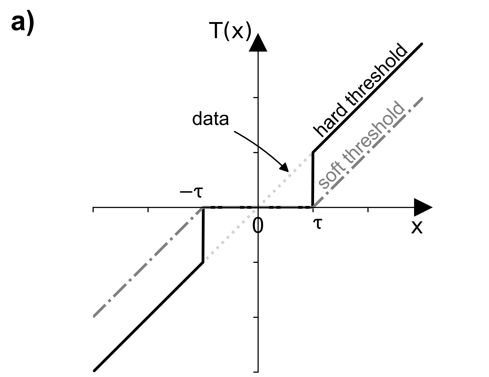
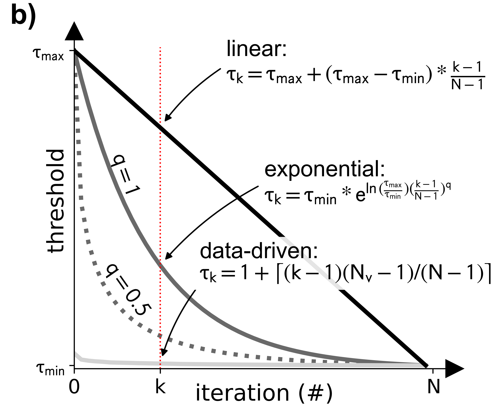
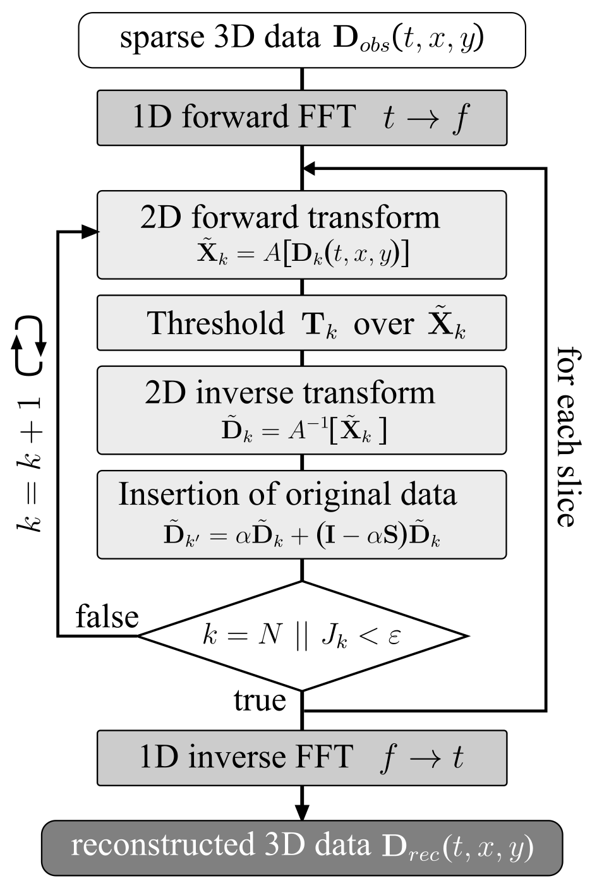
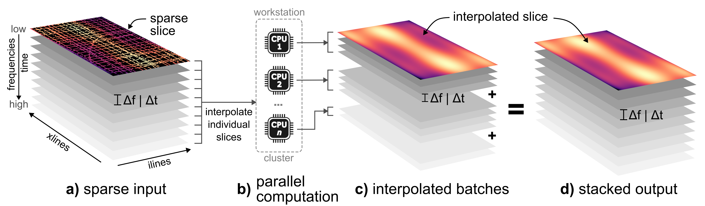

# 3D interpolation of sparse cube

Interpolating sparse 3D cube using _Projection Onto Convex Sets_ (POCS) method with user-specified transform (e.g. `FFT`, `wavelet`, `shearlet`, or `curvelet`).

!!! warning

    Please note that the **`curvelet` transform** is only available on Unix-like systems (see [Installation instructions](../index.md#Installation)).

## Description

For a more detailed description, please refer to the [workflow paper](../citation.md).

### POCS theory

The POCS is an iterative algorithm, which can be used to reconstruct seismic data (Abma and Kabir, 2006).
The iterative formula of the _weighted_ POCS algorithm at the _k_-th iteration is:

$$
\textbf{D}_k = \alpha\textbf{D}_{obs} + [\textbf{I} - \alpha \textbf{M}]  A^{-1} \textbf{T}_k A \textbf{D}_{k-1}, \quad k=1,2,...,N
$$

where $\textbf{D}_k$ is the reconstructed data at iteration $k$, $\alpha$ is a weighting factor ($0 < \alpha ≤ 1$), $\textbf{D}_{obs}$ is the observed sparse data, $\textbf{I}$ is the identity matrix, $\textbf{M}$ is the sampling matrix, $A$ and $A^{-1}$ the forward and inverse transforms (e.g., FFT), respecitvely. $N$ is the total number of iterations and $\textbf{T}_k$ the iteration-dependent threshold.

This threshold operator is either _hard_ (L0 norm) or _soft_ (L1 norm) and illustrated in Figure 1a. For improved convergence, three (3) different threshold models are implemented (Figure 1b).

- linear
- exponential (adjustable via exponent $q$)
- data-driven

{ width="350" }
{ width="350" }

<figcaption>Figure 1: (a) Threshold operators, (b) threshold models.</figcaption>

!!! note "Threshold operator and model"

    A decision for the _hard_ or _soft_ threshold operator is largely dependent on the input data. There are; however, no large difference based on our numerical testing.
    With regards to the threshold model, the _exponential_ decay function offers the most flexibility while producing reliable results.

Besides the _regular_ POCS, our implementation supports the _fast_ (FPOCS) and _data-driven_ POCS.The FPOCS is based on the work by Yang et al. (2013) as well as Gan et al. (2015, 2016) and implemented as:

$$
\displaylines{
    \textbf{D}_k^{`} = \textbf{D}_k + \frac{v_k-1}{v_k+1}(\textbf{D}_k - \textbf{D}_{k-1}), \\
    \textbf{D}_{k+1} = \textbf{D}_{obs} + (\textbf{I}-\textbf{M})\textbf{A}^{-1}\textbf{T}_{\tau}(\textbf{A}\textbf{D}_k^{`})
}
$$

with $v_n$ as controlling parameter with initial values $v_0 = v_1 = 1$ and $v_n = (1 + \sqrt{1 + 4 v_n^2})/2$.

!!! note "Choosing the _correct_ POCS implementation"

    The FPOCS is our recommended implementation as its convergence is much faster than of the _regular_ and _data-driven_ POCS by using less iterations. The effectiveness of the _data-driven_ POCS is largly dependent on the input data quality and, based on our experiences, not always suitable for field data. 

The convergence is monitored by a cost function $J_k$, which is compared to the user-defined stop criterion $\epsilon$:

$$
J_k = \frac{
|| \textbf{D}_{k} -  \textbf{D}_{k-1}||^2_2
}{
|| \textbf{D}_{k}||^2_2
}
$$

A flowchart of the POCS algorithm is shown in Figure 2:

<figure markdown>
{ width="400" }
<figcaption>Figure 2: Conceptual flowchart of POCS algorithm in the frequency domain.</figcaption>
</figure markdown>

### Implementation

This POCS implementation designed to interpolate multiple 2D frequency (or time) slices in parallel. The workflow could be relatively easy scaled from a local workstation or laptop to a remote cluster, which is possible by utilizing the [`dask`](https://www.dask.org/) package.

Each CPU receives a number of 2D slices (e.g., `batch_chunk=20`), which are save to individual netCDF files (Figure 3c) before all chunks are merged into a single cube (Figure 3d).

<figure markdown>
{ width="700" }
<figcaption>Figure 3: Conceptual diagram showing the parallel interpolation of multiple frequency or time slices.</figcaption>
</figure markdown>

For more detail regarding the implementation, please refer to the API documenation.

## Usage

This script is designed to be used from the terminal (i.e. command line).

### Command line interface

The script requires a **single netCDF** (3D) and a **configuration YAML** file:

There are two options to run the script. We recommend using the CLI entry point like:

```bash
>>> 13_cube_interpolate_POCS /path/to/sparse_cube.nc \
      --path_pocs_parameter /path/to/config.yml [optional parameters]
```

Alternatively, the script can be executed using the (more verbose) command:

```bash
>>> python -m pseudo_3D_interpolation.cube_POCS_interpolation_3D /path/to/sparse_cube.nc \
      --path_pocs_parameter /path/to/config.yml [optional parameters]
```

Optionally, the following parameters can be specified:

- `--help`, `-h`: Show help.
- `--path_pocs_parameter`: Path of netCDF parameter file (YAML format). **Required!**
- `--path_output_dir`: Output directory for interpolated slices. Defaults to basedir of input cube.
- `--verbose {LEVEL}`: Level of output verbosity (default: `0`).

### Configuration file

The configuration file is the essential input for the 3D interpolation. In there, all relevant input parameter for the PCOS algorithm need to be specified.  
An example file might look like this:

```yaml
# === NETCDF PARAMETER ===
# dimension name of input cube, e.g. 'freq_twt' (frequency domain) or 'twt' (time domain)
dim: 'freq_twt'
# name of netCDF variable
var: 'freq_env'

# === DASK PARAMETER ===
# number of slices per worker (e.g. CPU)
batch_chunk: 20
# number of dask worker (i.e. CPUs on local machine)
n_workers: 12
# use `processes` (**recommended!**) or `threads`
processes: True  # much faster on local machine (LocalCluster)
threads_per_worker: 1
memory_limit: '2.5GB'

# === POCS PARAMETER ===
metadata:
  # sparse transform
  transform_kind: 'FFT'
  niter: 50
  eps: 1e-16
  # treshold operator (hard, garrote, soft)
  thresh_op: 'hard'
  # threshold model (linear, exponential, data-driven, inverse-proportional)
  thresh_model: 'exponential-1'
  # threshold decay kind (values, )
  decay_kind: 'values'
  # max regularization percentage
  p_max: 0.99
  # min regularization percentage 1e-4
  p_min: 'adaptive'
  # weighting factor
  alpha: 0.75
  # apply np.sqrt to threshold decay
  sqrt_decay: False
  # POCS version (regular, fast, data-driven)
  version: 'fast'
  # verbose output to stdout
  verbose: False

# apply conservative smoothing filter over interpolated slices prior to merging ('gauss', 'median', False)
apply_filter: 'gauss'

# === DEV ===
output_runtime_results: true
```

## References

- Abma, Ray, and Nurul Kabir. 2006. “3D Interpolation of Irregular Data with a POCS Algorithm.” _Geophysics_ 71 (6): E91–97. [https://doi.org/10.1190/1.2356088](https://doi.org/10.1190/1.2356088).
- Gan, Shuwei, Shoudong Wang, Yangkang Chen, and Xiaohong Chen. 2015. “Seismic Data Reconstruction via Fast Projection onto Convex Sets in the Seislet Transform Domain.” In _SEG Technical Program Expanded Abstracts 2015_, 3814–19. SEG Technical Program Expanded Abstracts. Society of Exploration Geophysicists. [https://doi.org/10.1190/segam2015-5744782.1](https://doi.org/10.1190/segam2015-5744782.1).
- Gan, Shuwei, Shoudong Wang, Yangkang Chen, Xiaohong Chen, Weiling Huang, and Hanming Chen. 2016. “Compressive Sensing for Seismic Data Reconstruction via Fast Projection onto Convex Sets Based on Seislet Transform.” _Journal of Applied Geophysics_ 130: 194–208. [https://doi.org/10.1016/j.jappgeo.2016.03.033](https://doi.org/10.1016/j.jappgeo.2016.03.033).
- Yang, Pengliang, Jinghuai Gao, and Wenchao Chen. 2013. “On Analysis-Based Two-Step Interpolation Methods for Randomly Sampled Seismic Data.” _Computers & Geosciences_ 51: 449–61. [https://doi.org/10.1016/j.cageo.2012.07.023](https://doi.org/10.1016/j.cageo.2012.07.023)