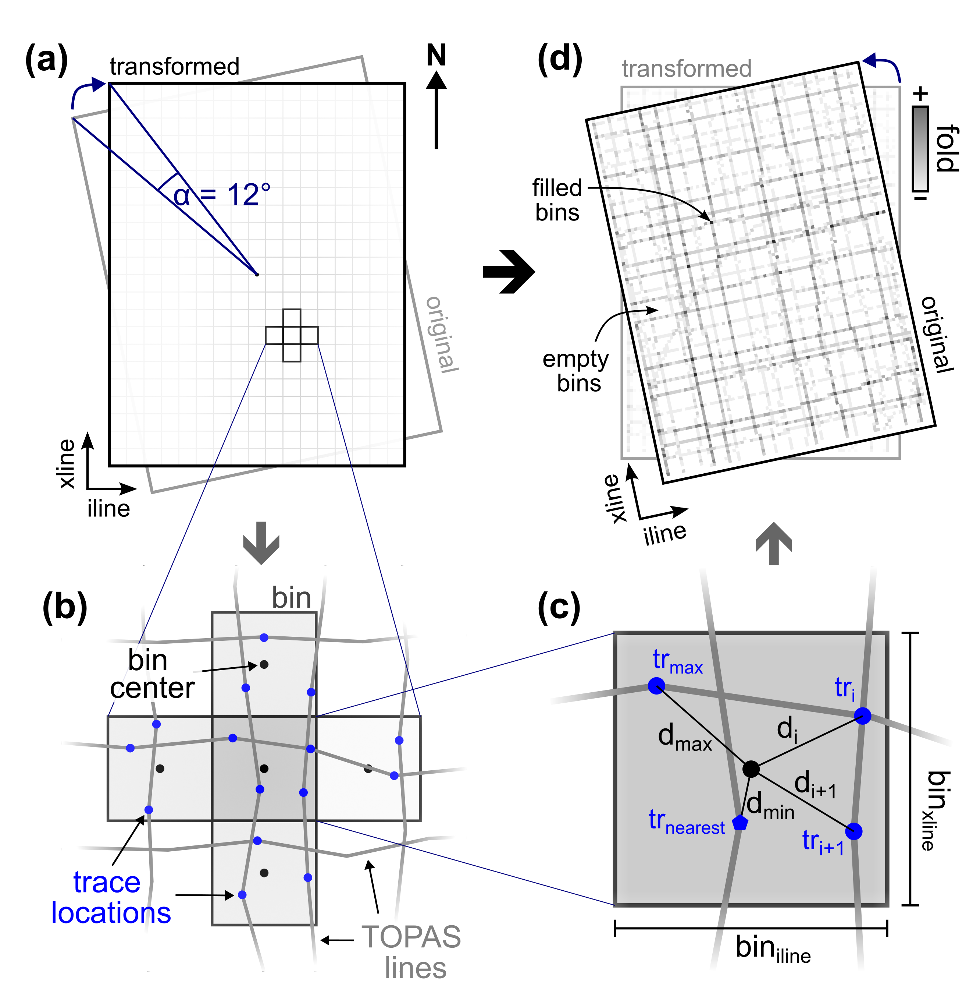

# 3D binning and geometry setup

Create sparse 3D cube geometry by binning traces from 2D profiles.

## Description

This script uses the following processing steps to setup a 3D cube geometry and assign traces to each bin:

1. **Setup 3D geometry** using
      - _rotation center_ and _angle_
      - output _cube extent_ (optionally with reference to study area extent)
2. **Transform coordinates** of all 2D profiles (x,y → iline/xline) using Affine transformation
3. **Stack** multiple traces within a single bin using 
      - _average_ amplitude
      - _median_ amplitude
      - _nearest trace(s)_ (calculated using spatial distance $d$)
      - _Inverse Distance Weighting_ (IDW) algorithm 
4. Create **inline netCDF files** from 2D profiles
5. Merge all inlines into a single **sparse 3D cube**
6. Transpose cube to time-major layout (il, xl, twt) → (twt, il, xl)

<figure markdown>
{ width="600" }
<figcaption>Figure: Conceptual 3D binning process, where tr: trace, d: distance.</figcaption>
</figure markdown>

!!! info "Suitable bin sizes"

    The bin sizes for a given dataset are largely dependent on (a) the _line spacing_ and (b) the _trace distance_ along individual lines. In case of survey lines with a predominant orientation, consider using an asymmetric bin size (e.g., 15 x 5 m).

## Usage

This script is designed to be used from the terminal (i.e. command line).

### Command line interface

The script can handle two different inputs:

1. datalist of files to process (e.g., `datalist.txt`)
2. directory with input files (e.g., `/input_dir`) 

There are two options to run the script. We recommend using the CLI entry point like:

```bash
>>> 10_cube_geometry_binning {datalist.txt | </directory>} 
    --params_netcdf /path/to/config.yml
    --params_spatial_ref /path/to/spatial_ref.yml 
    --params_cube_setup /path/to/cube_setup.yml
    --path_coords {/path/to/segys/ | /path/to/auxiliary/file.nav}
    [optional parameters]
```

Alternatively, the script can be executed using the (more verbose) command:

```bash
>>> python -m pseudo_3D_interpolation.cube_binning_3D {datalist.txt | </directory>} 
    --params_netcdf /path/to/config.yml 
    --params_spatial_ref /path/to/spatial_ref.yml
    --params_cube_setup /path/to/cube_setup.yml
    --path_coords {/path/to/segys/ | /path/to/auxiliary/file.nav}
    [optional parameters]
```

Optionally, the following parameters can be specified:

- `--help`, `-h`: Show help.

- `--params_netcdf`: Path of netCDF parameter file (YAML format). **Required!**

- `--params_spatial_ref`: Path of spatial reference parameter file with CRS as WKT string (YAML format). **Required!**

- `--params_cube_setup`: Path of config file for cube geometry setup (YAML format). **Required!**

- `--output_dir {DIR}`: Output directory for edited SEG-Y file(s).

- `--suffix {sgy}`, `-s`: File suffix (default: `sgy`). Only used if directory is specified.

- `--filename_suffix {SUFFIX}`: Filename suffix for guided selection (e.g. `env` or `despk`). Only used when `input_path` is a directory.

- `--attribute`, `-a:`: Seismic attribute to compute.

- `--coords_origin {header | aux}`: Origin of (shotpoint) coordinates (default: `header`).

- `--path_coords`: Path to SEG-Y directory (coords_origin = `header`) or auxiliary navigation file with coordinates (coords_origin = `aux`). **Required!**

- `--coords_fsuffix`: File suffix of auxiliary or SEG-Y files (depending on chosen parameter for `coords_origin`.

- `--bin_size`: Bin size(s) in inline and crossline direction(s) given in CRS units (e.g., meter). Single value or space-separated `inline` and `crossline` values.

- `--twt_limits {MIN MAX}`: Vertical two-way travel time range of output 3D cube (in ms).

- `--parallel`: Process files in parallel (default: False)

- `--encode`: Use encoding to compress output file size based on JSON parameter file (`params_netcdf`).

- `--stacking_method`: Stacking method for multiple traces within one bin (default: `average`)
  
     - 'average', 'median', 'nearest', or 'IDW'

- `--factor_dist`: Distance factor controlling the impact of weighting function: $1/(distance^{factor})$. Only used if stacking_method=`IDW`.

- `--dtype_data`: Output dtype of created 3D cube (default: `float32`).

- `--name`: Optional identifier string to add to exported files.

- `--write_aux`: Write auxiliary files featuring key cube parameters (default: `False`).

- `--verbose {LEVEL}`, `-V`: Level of output verbosity (default: `0`).

### Configuration files

#### netCDF parameter

This config file specifies netCDF metadata information and is used in subsequent scripts as well.

```yaml
# parameter for frequency domain
attrs_freq:
  data:
    description: Spectral amplitudes of frequency spectrum
    long_name: amplitude
    units: '-'
  new_dim:
    description: Frequencies of seismic signal
    long_name: frequency
    units: kHz
# parameter for time domain
attrs_time:
  amp:
    description: Measure of reflection strength of property contrast between layers
    long_name: seismic amplitude
    seismic_attribute: amplitude
    units: '-'
  cube:
    description: Sparse pseudo-3D cube created from TOPAS profiles
    history: ''
    long_name: central cube
  env:
    description: Phase-independent representation of seismic amplitude (instantaneous
      amplitude)
    long_name: signal envelope
    seismic_attribute: envelope
    units: '-'
  fold:
    description: Number of stacked traces per bin
    units: '#'
  iline:
    long_name: iline
    units: '#'
  twt:
    long_name: two-way travel time
    standard_name: TWT
    units: ms
  x:
    long_name: easting
    standard_name: projection_x_coordinate
    units: m
  xline:
    long_name: xline
    units: '#'
  y:
    long_name: northing
    standard_name: projection_y_coordinate
    units: m
encodings:
  amp:
    _FillValue: -32768
    dtype: int16
    scale_factor: 5.0e-05
  env:
    _FillValue: 0
    dtype: uint16
    scale_factor: 3.0e-05
# auxiliary netCDF variables
var_aux:
    - fold
    - ref_amp
```

#### Spatial reference

The coordinate reference system (CRS) is specified as a WKT string in a separated YAML file. An example for `WGS 84 / UTM zone 60S` is shown below:

```yaml
PROJCS["WGS 84 / UTM zone 60S",GEOGCS["WGS 84",DATUM["WGS_1984",SPHEROID["WGS 84",6378137,298.257223563,AUTHORITY["EPSG","7030"]],AUTHORITY["EPSG","6326"]],PRIMEM["Greenwich",0,AUTHORITY["EPSG","8901"]],UNIT["degree",0.0174532925199433,AUTHORITY["EPSG","9122"]],AUTHORITY["EPSG","4326"]],PROJECTION["Transverse_Mercator"],PARAMETER["latitude_of_origin",0],PARAMETER["central_meridian",177],PARAMETER["scale_factor",0.9996],PARAMETER["false_easting",500000],PARAMETER["false_northing",10000000],UNIT["metre",1,AUTHORITY["EPSG","9001"]],AXIS["Easting",EAST],AXIS["Northing",NORTH],AUTHORITY["EPSG","32760"]]
```

#### 3D cube setup parameter

All required information for the geometry of the created 3D cube are specified in a designated YAML file. An example file might look like this:

```yaml
# name of pseudo-3D cube
name: cube_center
long_name: central cube
# seismic attribute, e.g amplitude (amp), envelope (env)
attribute: amp
# bin size(s) for il/xl directions (in CRS units, e.g. meter)
bin_size: #5
  - 5   # iline bin size (along y-axis)
  - 5   # xline bin size (along x-axis)
# min/max TWT limits of output pseudo-3D cube (in ms)
twt_limits: 
  - 725
  - 925
# Stack multiple traces within a single bin using this method ('average', 'median', 'nearest', 'IDW')
stacking_method: IDW
factor_dist: 1.0    # only used if `stacking_method` == 'IDW'
# spatial reference of extent coordinates (should be identical to SEG-Y CRS)
spatial_ref: EPSG:32760
rotation_center: 
  - 297335 
  - 5125120
 # positive in clockwise direction (in degree)
rotation_angle: 12
# extent of the actual pseudo-3D cube to generate
extent_cube:
  lower_left: 
    - 296586.4282892714
    - 5123519.385932244
  upper_left:
    - 295994.9195288948
    - 5126302.215856332
  upper_right:
    - 298063.7017044469
    - 5126741.949082412
  lower_right:
    - 298655.2104648235
    - 5123959.119158324
# OPTIONAL: extent of the overall study area (must be larger than `extent_cube`)
extent_study_area:
  lower_left: 
    - 294112.69854084
    - 5120631.97166828
  upper_left:
    - 292594.94319787
    - 5127772.44915364
  upper_right:
    - 300664.66090393
    - 5129487.72060288
  lower_right:
    - 302182.4162469
    - 5122347.24311753
```