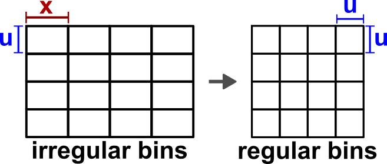
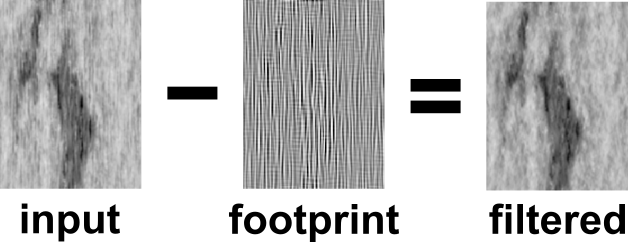
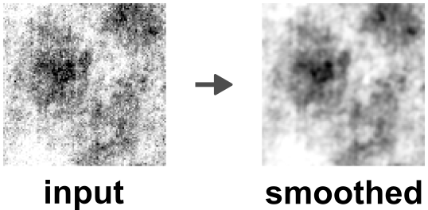
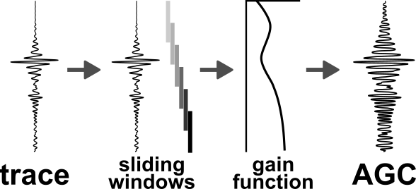

# Post-processing (3D)

Recommended post-processing steps applied to sparse 3D cube _after_ POCS interpolation.

## Description

### Inline/crossline upsampling

One optional post-processing step is the upsampling of the inline or crossline bin size to match respective smaller bin size (**Figure 1**). The default approch is a simple `linear` interpolation, which is only sufficient for small bin size differences. Available interpolation methods are listed in the documentation for the [xarray.Dataset.interp_like](https://docs.xarray.dev/en/stable/generated/xarray.Dataset.interp_like.html) function. 

Additionally, one can apply a filter to reduce the spatial aliasing if present using the `--spatial-dealiasing` switch.

Upsampling is triggered using the following command line parameter:

```
--upsample {linear (default) | nearest | slinear | cubic | polynomial}
--spatial-dealiasing  # Whether to apply filter in kx-ky domain to remove spatial aliasing.
```

<figure markdown>
{ width="500" }
    <figcaption>Figure 1: Schematic of inline/crossline upsampling to even bin sizes.</figcaption>
</figure>

### Acquisition footprint removal

Acquisition footprint describes _linear spatial grid patterns_ seen on 3D time slices (**Figure 2**). Commonly caused by the aquisition pattern and direction for multichannel seismic data, these patterns might be present in high-resolution SBP data as well.

Individual time/frequency slices are filtered by damping zero-centered amplitudes in the $k_x-k_y$ domain after 2D FFT application (**Figure 2**). Our implementation allows the footprint removal over:

- (time) slice

- profile (automatic iline/xline detection)

- profile-iline (over inlines)

- profile-xline (over crosslines)

The removal of the acquisition footprint is triggered using the following command line parameter:

```
--remove-footprint {slice | profile | profile-iline | profile-xline}
```

<figure markdown>
{ width="700" }
    <figcaption>Figure 2: Acquisition footprint removal via 2D FFT filter application.</figcaption>
</figure>

### Smoothing of time/frequency slices

The data can be filtered in the frequency domain to remove white noise (**Figure 3**). Two different filters are supported:

- **gaussian**: `--smooth gaussian --smooth-sigma {default: 1}`
- **median**: `--smooth median --smooth-size {default: 3}`

Additionally, the smoothed slices can be rescaled to a specific percentile range of the input data (default: [0.01, 99.99]) using `--rescale {0.01 99.99}`.

<figure markdown>
{ width="500" }
    <figcaption>Figure 3: Smoothing of time/frequency slices (using Gaussian filter).</figcaption>
</figure>

### Automatic Gain Control (AGC)

One of the most common gain functions is the Automatic Gain Control (AGC) using _time-variant scaling_ to increase weak amplitudes. AGC is applied to the data on a trace-by-trace basis using a sliding time window (**Figure 4**). The scale factor calculated for each sliding window can refer to the `rms` (default), `mean`, or `median` amplitude.

```
--agc --agc-win {window length} --agc-kind {rms | mean | median}
```

!!! warning

    Be aware that the window length is in seconds!

<figure markdown>
{ width="600" }
    <figcaption>Figure 4: Conceptual functionality of an Automatic Gain Control (AGC) filter.</figcaption>
</figure>

## Usage

This script is designed to be used from the terminal (i.e. command line).

### Command line interface

The script needs a **single netCDF** (3D) as input:

There are two options to run the script. We recommend using the CLI entry point like:

```bash
>>> 15_cube_postprocessing /path/to/cube.nc [optional parameters]
```

Alternatively, the script can be executed using the (more verbose) command:

```bash
>>> python -m pseudo_3D_interpolation.cube_postprocessing_3D /path/to/cube.nc [optional parameters]
```

Optionally, the following parameters can be specified:

- `--help`, `-h`: Show help.
- `--path_out`: Output path of pre-processed 3D cube.
- `--upsample`: Upsample `xarray.Dataset` to equal bin size along ilines and xlines.
     - `linear`, `nearest`, `slinear`, `cubic`, or `polynomial`
- `--spatial-dealiasing`: Whether to apply filter in kx-ky domain to remove spatial aliasing.
- `--remove-footprint`: Remove acquisition footprint (default: `slice`).
- `--direction`: Direction of acquisition footprint removal filter (default: `both`).
- `--footprint-sigma`: Standard deviation for smoothing Gaussian filter (default: `7`) to remove footprint.
- `--buffer-center`: Percentual buffer (0-1) around center in $k_x-k_y$ domain (default: `0.20`).
- `--buffer-filter`: Footprint filter buffer size (in grid cells, default: `3`).
- `--smooth {gaussian | median}`: Smooth slices (frequency or time domain).
- `--smooth-sigma`: Standard deviation for Gaussian kernel (default: `1`).
- `--smooth-sigma`: Shape of Median kernel (identical for iline and xline) in grid cells (default: `3`).
- `--rescale`: Rescale smoothed slices to given percentile range (without arguments: [0.01, 99.99]).
- `--verbose {LEVEL}`: Level of output verbosity (default: `0`).
