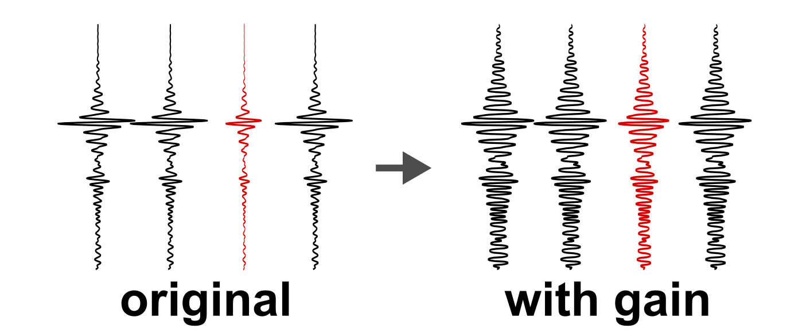
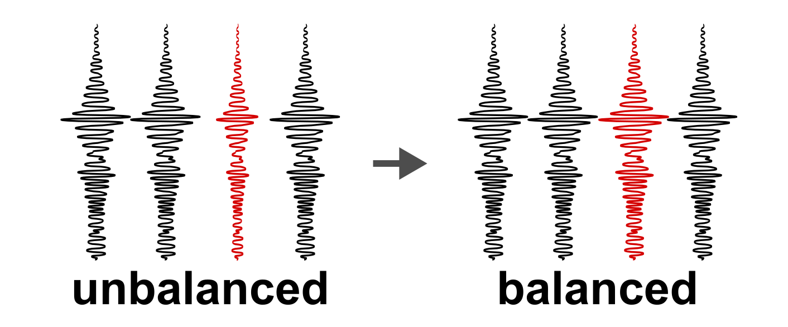
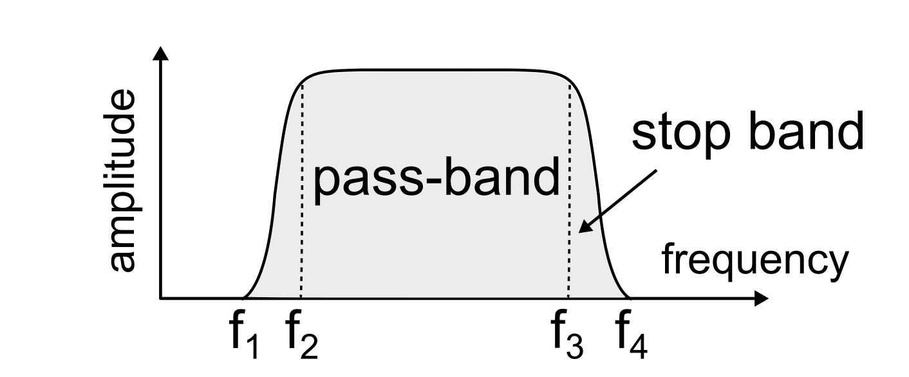
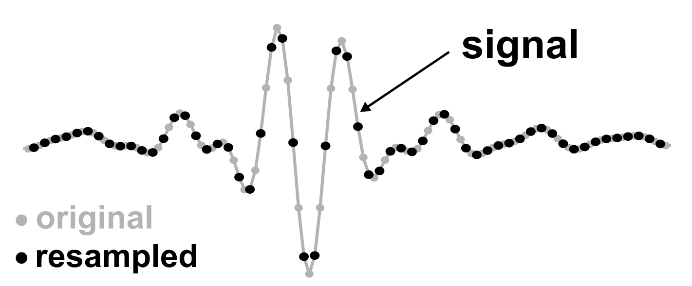
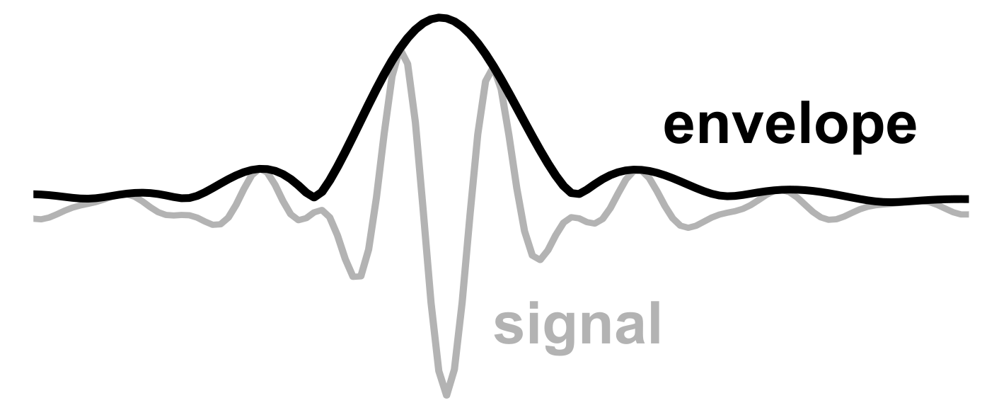

# Pre-processing (3D)

Recommended pre-processing steps applied to sparse 3D cube prior to POCS interpolation.

## Description

### Gain application

Optionally, one can apply one or multiple gain function(s) following the approach of the Seismic Unix module `sugain`.  
For more information about the usage and input parameter of this module please refer to its [manual](http://sepwww.stanford.edu/oldsep/cliner/files/suhelp/sugain.txt).

Common gain parameter to compensate the spherical divergence effect would be:

```python
--gain tpow=2 gpow=0.5
```

<figure markdown>
{ width="500" }
    <figcaption>Figure 1: Schematic of gain application, e.g. to compensate the spherical divergence.</figcaption>
</figure>

### Trace balancing

Varying environmental conditions like the sea state might influence the recorded signal strength, which can be compesated by balancing all traces to with reference to their respective root mean square (rms) $A(t)_b = A(t)/A(t)_{rms}$ or maximum amplitude $A(t)_b = A(t)/A(t)_{max}$.

The _rms_ amplitude is calculated using the amplitudes $a$ and the total number of samples $N$:

$$
rms = \sqrt{\frac{\sum{a^2}}{N}}
$$

Trace balancing is triggered using the following command line parameter:

```
--balance {rms | max}
```

<figure markdown>
{ width="500" }
    <figcaption>Figure 2: Schematic of trace (amplitude) balancing.</figcaption>
</figure>

### Frequency filtering

The data can be filtered in the frequency domain to remove low and/or high-frequency noise outside the signal bandwidth. Three different filters are supported:

- **highpass**: `--filter highpass --filter_freqs {f_cutoff | f1} {f_stopband | f2}`
- **lowpass**: `--filter lowpass --filter_freqs {f_stopband | f3} {f_cutoff | f4}`
- **bandpass**: `--filter bandpass --filter_freqs f1 f2 f3 f4`

!!! info

    The frequency must be specified in **Hertz** (Hz).

<figure markdown>
{ width="500" }
    <figcaption>Figure 3: Schematic of band-pass filtering in the frequency domain.</figcaption>
</figure>

### Trace resampling

Both up and downsampling (Figure 4) are supported using either [`scipy.signal.resample`](https://docs.scipy.org/doc/scipy/reference/generated/scipy.signal.resample.html) or [`scipy.signal.resample_poly`](https://docs.scipy.org/doc/scipy/reference/generated/scipy.signal.resample_poly.html). Additionally, either `resampling_interval`, `resampling_frequency`, or `resampling_factor` must be provided. A window function (`window_resample`) can be applied before resampling the traces.

The command line input to downsample the input data by factor 2 using `scipy.signal.resample` would look like this:

```
--resampling_function resample --resampling_factor 2
```

<figure markdown>
{ width="500" }
    <figcaption>Figure 4: Schematic of trace resampling, e.g. downsampling by factor 2.</figcaption>
</figure>

!!! warning

    Be aware of the Nyquist frequency when downsampling to avoid aliasing.

### Trace envelope

In addition, this script can calculate the trace amplitude (_instantaneous amplitude_) for all input traces of the sparse cube. The envelope of a seismic trace $E(t)$ is independent of the phase and calculated using the following equation ([SEG Wiki](https://wiki.seg.org/wiki/Dictionary:Trace_envelope)):

$$
E(t) = \sqrt{(\textrm{Real}\ s(t))^2 + (\textrm{Imag}\ s(t))^2}
$$

with $\textrm{Real}$ and $\textrm{Imag}$ representing the real and imaginary parts of the analytic trace, respectively. In this case, the $\textrm{Real}\ s(t)$ is just the original seismic signal, whereas $\textrm{Imag}\ s(t)$ is computed using the Hilbert transform of the signal ([SEG Wiki](https://wiki.seg.org/wiki/Dictionary:Hilbert_transform)).
Computing the trace envelope is a common processing step in order to display sub-bottom profiler data with hihg vertical sampling rates like TOPAS or PARASOUND (Henkart, 2006).

The following flag triggers the envelope calculation (after any previously applied processing step):

```
--envelope
```

<figure markdown>
{ width="500" }
    <figcaption>Figure 5: Schematic of seismic signal (grey) and its envelope (black).</figcaption>
</figure>

## Usage

This script is designed to be used from the terminal (i.e. command line).

### Command line interface

The script needs a **single netCDF** (3D) as input:

There are two options to run the script. We recommend using the CLI entry point like:

```bash
>>> 11_cube_preprocessing /path/to/cube.nc --params_netcdf /path/to/config.yml [optional parameters]
```

Alternatively, the script can be executed using the (more verbose) command:

```bash
>>> python -m pseudo_3D_interpolation.cube_preprocessing_3D /path/to/cube.nc \
      --params_netcdf /path/to/config.yml [optional parameters]
```

Optionally, the following parameters can be specified:

- `--help`, `-h`: Show help.
- `--params_netcdf`: Path of netCDF parameter file (YAML format). **Required!**
- `--path_out`: Output path of pre-processed 3D cube.
- `--gain`: Parameter for (time-variant) gain function(s), e.g. `tpow=2 gpow=0.5`
- `--use_samples`: Use samples instead of TWT for (time-variant) gain function(s).
- `--balance`: Method to define reference amplitude for (time-invariant) scaling. 
    - `rms`, `max`
- `--store_ref_amp`: Store reference amplitude used for trace balancing as netCDF variable.
- `--filter`: optional filter to apply prior to FFT computation.
    - `highpass`, `lowpass`, `bandpass`
- `--filter_freqs`: Filter corner frequencies (in Hz), e.g. `1000 1200 6000 6200`
- `--resampling_function`: Resampling function from [`scipy.signal`](https://docs.scipy.org/doc/scipy/reference/signal.html).
    - `resample`, `resample_poly`
- `--resampling_interval`, `-dt`: Output sampling interval/period of signal (in ms).
- `--resampling_frequency`, `-fs`: Output sampling frequency/rate of signal (in Hz).
- `--resampling_factor`, `-f`: Resampling factor (_<1_: upsampling, _>1_: downsampling).
- `--window_resample`: Window function for resampling (from [`scipy.signal.windows`](https://docs.scipy.org/doc/scipy/reference/signal.html#window-functions)).
- `--envelope`: Calculate trace envelope.
- `--verbose {LEVEL}`: Level of output verbosity (default: `0`).
