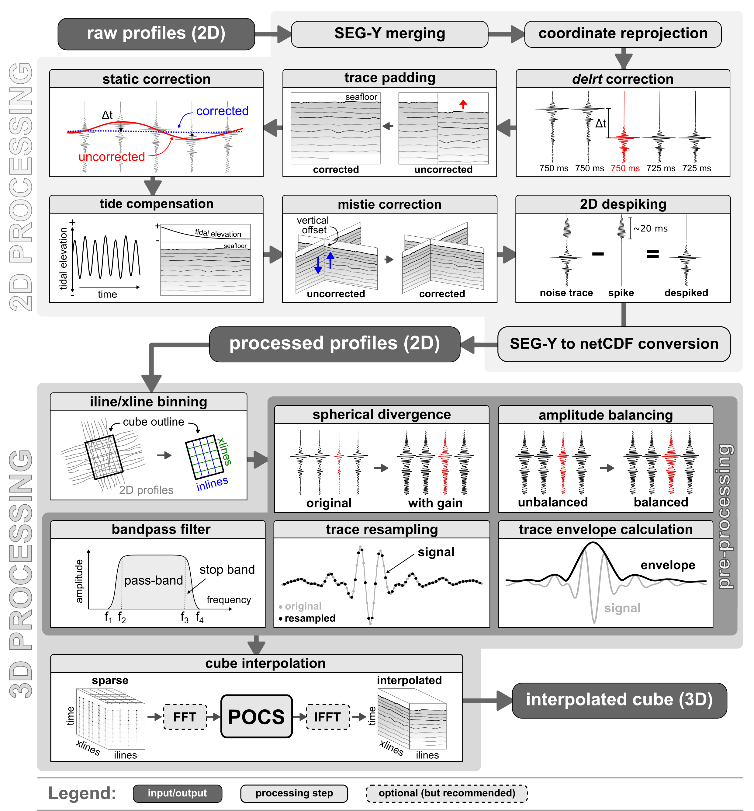

# Workflow structure

This workflow was created to enable the interpolation of high-resolution subbottom profiler data (2-6 kHz) into pseudo-3D cubes. Potential applications include:

- **Pseudo-3D interpolation** of:
  
     - subbottom profiler data (SBP)
  
     - single channel reflection seismic (SCS)
  
     - multichannel reflection seismic (MCS)

- **Upsampling** of existing post-stack 3D seismic volumes (e.g., in crossline direction)

The workflow can be subdivided into two separate stages (**Figure 1**):

1. **2D (pre-)processing** of individual profiles
2. **3D interpolation** of binned, sparse cube

## Stage 1: Processing of SBP profiles (2D)

The most essential pre-processing steps for a subsequent 3D interpolation aim to correct the vertical offset between the input profiles. Without a sufficient correction, such offsets, especially at profile intersections, result in low quality interpolation outputs. This issue is addressed by three processing steps in the fist stage (**Figure 1**, _upper panel_):

- [Static correction](2D/static_correction.md) (per profile)
- [Tidal heave compensation](2D/tide_compensation.md) (per profile)
- [Mistie correction](2D/mistie_correction.md) (using all profiles) 

!!! info "2D stage: Input data types"

    For most of the scripts of the 2D processing stage, three different input types are allowed:
    
    1. single **SEG-Y file** (e.g., `filename.sgy`)
    2. **datalist** of files to process (e.g., `datalist.txt`)
    3. **directory** with input files (e.g., `/input_dir`) 
    
    The `datalist` is a plain text file that contains the path and name of files to process relativ to the `datalist.txt` file:
    
        ./folder/file1.sgy
        ./folder/file2.sgy
    
    for an examplary folder structure like this:
    
        |-- folder/
        |    |-- file1.sgy
        |    |-- file2.sgy
        |-- datalist.txt

## Stage 2: Sparse data interpolation (3D)

In the second stage, the following processing steps are conducted (**Figure 1**, _lower panel_):

- [Binning and geometry setup](3D/cube_binning_geometry.md)

- [Preprocessing](3D/preprocessing_3D.md) of sparse 3D cube
  
     - [Gain application](3D/preprocessing_3D/#gain-application)
  
     - [Amplitude balancing](3D/preprocessing_3D/#trace-balancing)
  
     - [Frequency filter](3D/preprocessing_3D/#trace-balancing) (lowpass, highpass, bandpass)
  
     - [Trace resampling](3D/preprocessing_3D/#trace-resampling)
  
     - [Trace envelope](3D/preprocessing_3D/#trace-envelope)

- [Forward FFT](3D/apply_FFT_3D.md) (_time_ to _frequency_ domain)

- [Interpolation via Projection Onto Convex Sets (POCS) algorithm](3D/3D_cube_interpolation.md)

- [Postprocessing](3D/postprocessing_3D.md) of interpolated 3D cube

- [Inverse FFT](3D/apply_inverse_FFT_3D.md) (_frequency_ to _time_ domain)

!!! info "3D stage: Input data"

    Most scripts of the second, 3D processing and interpolation stage require a single `netCDF` file and, most often, one or more `YAML` configuration files.  
    An exception is the **binning** script, which needs multiple 2D **netCDF** files.

<figure markdown>
{ width="700" }
    <figcaption>Figure 1: Schematic diagram of pseudo-3D interpolation workflow showing two stages: 2D processing of each profile (upper panel) and 3D interpolation of sparse 3D cube (lower panel).</figcaption>
</figure>